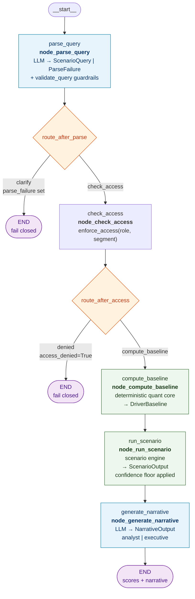
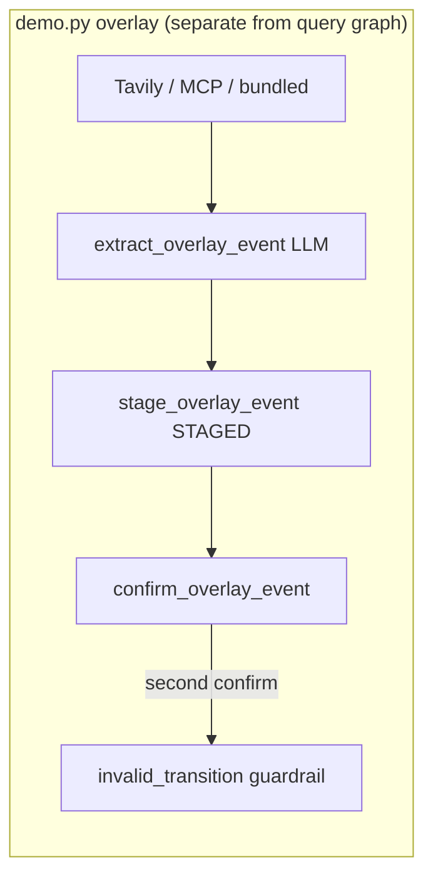

# UHG Geopolitical & Regulatory Risk Intelligence — Proof of Concept

A designed-but-unvalidated proof of concept adapting a multi-source
geopolitical risk intelligence framework to UnitedHealth Group. Full design
rationale, pressure-test findings, and covers the code specifically:
what's real, what's synthetic, what needs API keys,tools, mcp, evals, observability,
guard rails, web search using Tavily and how to run it.

#####################

# LangGraph flow — `src/graph.py`

This diagram matches the **compiled query pipeline** built by `build_graph()` in
`src/graph.py`. Node names are identical to the LangGraph node IDs (visible in
Phoenix traces).

Copy into [mermaid.live](https://mermaid.live) or VS Code Mermaid preview.

## Compiled query graph (used by `demo.py query`)



## `PipelineState` (graph state)

| Field | Set by | Purpose |
|---|---|---|
| `question` | input | Raw NL question |
| `role` | input | Access control role |
| `audience` | input | `analyst` or `executive` narrative |
| `indicator_scores` | input | DataFrame or `list[dict]` for checkpointer |
| `query` | `parse_query` | Validated `ScenarioQuery` |
| `parse_failure` | `parse_query` | Fail-closed parse/guardrail result |
| `access_denied` | `check_access` | Role not allowed for segment |
| `baseline` | `compute_baseline` | Deterministic driver baseline |
| `scenario` | `run_scenario` | Disruptor-adjusted scenario output |
| `narrative` | `generate_narrative` | Final LLM narrative |

## Routing functions

```python
# route_after_parse — after parse_query
parse_failure?  → "clarify"  → END
else            → "check_access"

# route_after_access — after check_access
access_denied?  → "denied"           → END
else            → "compute_baseline"
```

## Optional: persistent memory (`demo.py --thread`)

When `build_graph(checkpointer=SqliteSaver(...))` is used, LangGraph persists
`PipelineState` between invocations on the same `thread_id`. On a follow-up
call, `indicator_scores` may be reused from checkpoint (see `demo.py`).

## Not in the compiled query graph

`node_request_overlay_confirmation` is **defined** in `graph.py` (LangGraph
`interrupt()` for human overlay confirmation) but **not wired** into
`build_graph()` today. The overlay path runs separately via
`demo.py overlay` → `overlay_extractor.py` + `guardrails/gates.py`.



## Phoenix

With `OBSERVABILITY_BACKEND=phoenix`, each LangGraph node appears as a span
in the Phoenix UI when running `demo.py query`. LLM spans nest under
`parse_query` and `generate_narrative`.


#####################


## Quick start

```bash
python -m venv venv && source venv/bin/activate
pip install -r requirements.txt

# Works immediately, no API key needed — deterministic core + graph control
# flow with mocked LLM steps, clearly labeled as such in the output:
python demo.py "How exposed is Optum Health to a Medicare Advantage rate cut this year?"

# Run the test suite (21 tests, no API key needed — see "What's testable
# without API keys" below):
PYTHONPATH=. pytest tests/ -v

# For a real end-to-end run with live LLM calls:
cp .env.example .env   # then fill in OPENAI_API_KEY
python demo.py "How exposed is Optum Insight to a cyber disruptor?"
# demo.py auto-loads .env from the repo root (no manual export needed)
```

## Data provenance — read this before presenting any output as real

| Data | Real or synthetic | Source |
|---|---|---|
| Segment revenue figures (`ontology.SEGMENT_REVENUE_USD_B`) | **Real, public** | UnitedHealth Group FY2025 SEC filings / earnings release |
| Backtest anchor events (`data/backtest_anchors.json`) | **Real, public** | UHG earnings disclosures; public reporting on the 2024 Change Healthcare incident |
| Indicator registry & driver loadings (`quant_core/ontology.py`) | **Synthetic, illustrative** | Constructed for this POC — no real CMS/IMD-style feed is wired up yet |
| Sample overlay event texts (`data/sample_overlay_texts.json`) | **Synthetic paraphrase** | Written to represent the real events in `backtest_anchors.json`; not verbatim quotations from any source |
| Expert-elicited weight rationale (`quant_core/weighting.py`) | **Synthetic** | Author's own judgment calls, documented inline — not sourced from any real UHG analyst |

**No proprietary or internal UnitedHealth Group data was used or is required
to run this project.** Nothing here should be presented as reflecting real
UHG internal methodology or data access.

## What's testable without API keys (and what isn't)

The deterministic quant core, scenario engine, and guardrail logic are pure
Python with no network dependency — `pytest tests/` runs all 21 tests with
zero setup and they genuinely exercise the harmonization transforms, the
low-N weighting fallback, the confidence-floor guardrail, and the graph's
fail-closed routing.

The three LLM steps (`src/ai_steps/`) need a real `OPENAI_API_KEY` to make
an actual model call — that part is not testable in an offline sandbox. What
*is* tested without a key is the guardrail logic that **wraps** those calls
(`tests/test_narrative_guardrail.py` mocks the model client and proves the
confidence-caveat guardrail holds even when the model tries to editorialize
about its own confidence) and the graph's control flow around them
(`tests/test_graph_mocked.py`).

Three real bugs were caught and fixed during this build, in case it comes up:
1. The retired-segment guardrail check didn't match on `"Optum International"`
   (space) vs. its alias `"Optum_International"` (underscore) — fixed in
   `guardrails/gates.py`.
2. `demo.py`'s no-API-key path mocked the query parser but not the narrative
   generator, so it still crashed looking for `OPENAI_API_KEY` — fixed by
   mocking both LLM steps in that code path.
3. `demo.py`'s synthetic indicator data only covered the three indicators
   used in the first scenario tested (Capital), so querying a Data_Digital
   driver found no data at all — fixed by generating scores across every
   registered indicator, not a hand-picked subset.

## Model tiers

| Step | Model | Why |
|---|---|---|
| Query parsing | `FAST_MODEL` (default `gpt-4o-mini`) | Low-ambiguity structured extraction |
| Narrative generation | `FAST_MODEL` | Templating/rewriting, not judgment |
| Overlay extraction | `STRONG_MODEL` (default `gpt-4o`) | Genuine judgment call (severity/immediacy/persistence ratings); paired with a mandatory human-confirmation gate regardless of model strength |

Override via `.env` — see `.env.example`.

## Optional MCP tools (supplemental data)

The main pipeline is unchanged. MCP is an **optional extra** the same CLI can
call for non-authoritative context (market data, backtest anchors, search).

```bash
# Built-in local server is always configured (no extra setup):
python demo.py tool list
python demo.py tool call local.list_schema
python demo.py tool call local.get_backtest_anchors
python demo.py tool call yfmcp.yfinance_get_ticker_info --symbol UNH
python demo.py tool call yfmcp.yfinance_get_ticker_info --symbol UNH --audience executive
python demo.py tool call local.get_backtest_anchors --raw   # full JSON if needed

# After a successful query run, append supplemental MCP context:
python demo.py query "How exposed is Optum Insight to cyber risk?" --mcp-context

# Overlay path: try MCP search tools first, then Tavily/bundled fallback:
python demo.py overlay --segment Optum_Insight --driver Cyber --mcp-search
```

Enable with `MCP_ENABLED=true` (default). Copy `mcp_servers.json.example` to
`mcp_servers.json` to add optional servers such as `yfmcp` for UNH ticker
context via `uvx yfmcp`.

With `OBSERVABILITY_BACKEND=phoenix`, spans export to the project named in
`PHOENIX_PROJECT` (default `uhg-risk-intelligence`). **Select that project**
in the Phoenix UI — traces do not appear if you are viewing `default` only.
MCP `tool list` / `tool call` emit spans (`mcp.call_tool`, `mcp.list_tools`).
Overlay live search (`--live-search`) emits a **`tavily.search`** span
(kind: RETRIEVER) with query, source URL, and content preview.

## Evals and observability

Two options, deliberately not both wired up by default (pick one rather than
running two observability stacks for a proof of concept):

- **LangSmith** (`LANGSMITH_API_KEY` in `.env`) — free tier, integrates
  natively with LangGraph since that's already the orchestration layer, gets
  you tracing and eval datasets with the least setup.
- **Arize Phoenix** — fully open source, self-hosted, no account or API key
  needed at all (`pip install arize-phoenix`, run locally). Better fit if
  you want a "no external dependency" story.

Eval sets to build (not yet populated ):
- Query-parser accuracy: labeled NL questions → expected `ScenarioQuery`
- Overlay-extraction calibration: double-rated ground truth (two independent
  raters per event — single-label grading is too strict for an inherently
  subjective 0-3 scale, per the pressure-test finding in the narrative doc)
- Core validation backtest: driver baselines vs. the two real anchor events
  in `data/backtest_anchors.json`

## Project layout

```
src/
  schemas.py              # every data contract — read this first
  quant_core/              # deterministic, no LLM — ontology, harmonize, weight, baseline
  scenario/engine.py       # disruptor x sector x segment, healthcare-specific pathways
  guardrails/gates.py      # confidence floor, overlay staging, access control
  ai_steps/                 # the three narrow LLM steps + search tool
  data/                     # real backtest anchors + synthetic registry/samples
  graph.py                  # LangGraph wiring — orchestration only, no agentic reasoning
tests/                      # 21 tests, all runnable without API keys
demo.py                     # CLI entry point, runs with or without a live API key
docs/
  langgraph_flow.md         # LangGraph node/edge diagram from src/graph.py
  project_flow.md           # Full project flow (CLI, overlay, MCP, observability)
```


