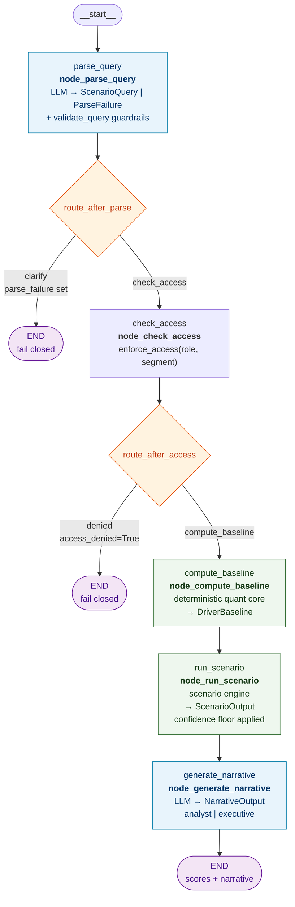
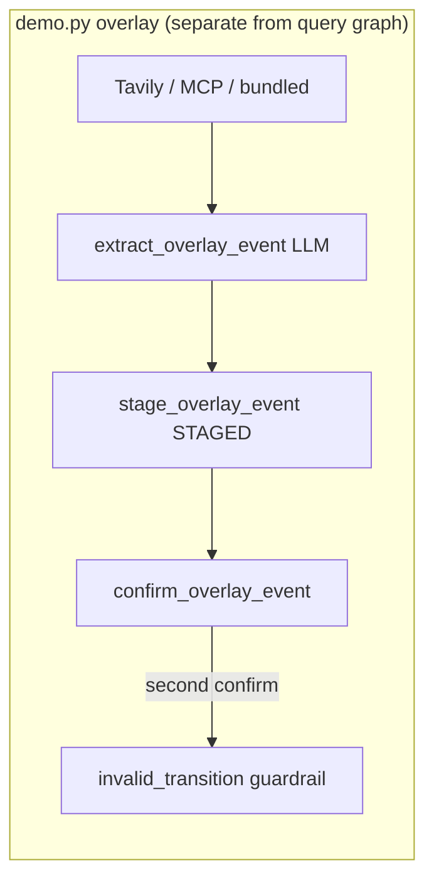

# LangGraph flow — `src/graph.py`

This diagram matches the **compiled query pipeline** built by `build_graph()` in
`src/graph.py`. Node names are identical to the LangGraph node IDs (visible in
Phoenix traces).

Copy into [mermaid.live](https://mermaid.live) or VS Code Mermaid preview.

## Compiled query graph (used by `demo.py query`)



## `PipelineState` (graph state)

| Field | Set by | Purpose |
|---|---|---|
| `question` | input | Raw NL question |
| `role` | input | Access control role |
| `audience` | input | `analyst` or `executive` narrative |
| `indicator_scores` | input | DataFrame or `list[dict]` for checkpointer |
| `query` | `parse_query` | Validated `ScenarioQuery` |
| `parse_failure` | `parse_query` | Fail-closed parse/guardrail result |
| `access_denied` | `check_access` | Role not allowed for segment |
| `baseline` | `compute_baseline` | Deterministic driver baseline |
| `scenario` | `run_scenario` | Disruptor-adjusted scenario output |
| `narrative` | `generate_narrative` | Final LLM narrative |

## Routing functions

```python
# route_after_parse — after parse_query
parse_failure?  → "clarify"  → END
else            → "check_access"

# route_after_access — after check_access
access_denied?  → "denied"           → END
else            → "compute_baseline"
```

## Optional: persistent memory (`demo.py --thread`)

When `build_graph(checkpointer=SqliteSaver(...))` is used, LangGraph persists
`PipelineState` between invocations on the same `thread_id`. On a follow-up
call, `indicator_scores` may be reused from checkpoint (see `demo.py`).

## Not in the compiled query graph

`node_request_overlay_confirmation` is **defined** in `graph.py` (LangGraph
`interrupt()` for human overlay confirmation) but **not wired** into
`build_graph()` today. The overlay path runs separately via
`demo.py overlay` → `overlay_extractor.py` + `guardrails/gates.py`.



## Phoenix

With `OBSERVABILITY_BACKEND=phoenix`, each LangGraph node appears as a span
in the Phoenix UI when running `demo.py query`. LLM spans nest under
`parse_query` and `generate_narrative`.
