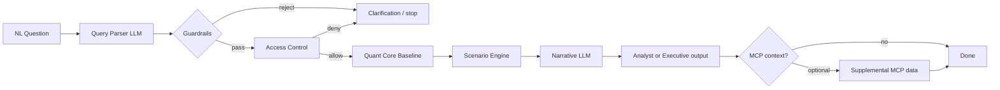

# UHG Risk Intelligence — Project Flow

Copy into any Mermaid renderer (GitHub, Notion, mermaid.live) or VS Code Mermaid preview.

```mermaid
flowchart TB
    subgraph CLI["demo.py — CLI entry points"]
        Q["query \"question\"<br/>--role --audience --thread<br/>--sparse-data --mcp-context"]
        O["overlay --segment --driver<br/>--live-search --mcp-search"]
        T["tool list | tool call<br/>--audience --raw"]
    end

    subgraph OBS["Observability (optional)"]
        PHX["Phoenix / LangSmith<br/>setup_observability()"]
        TR["Traces: LangGraph, OpenAI,<br/>Instructor, MCP spans"]
    end

    CLI --> PHX
    PHX --> TR

    %% ── Query pipeline (LangGraph) ──
    Q --> G_START((Start))

    G_START --> N1["parse_query<br/><i>LLM: gpt-4o-mini + Instructor</i>"]
    N1 --> V1{"validate_query<br/>guardrails"}

    V1 -->|out_of_scope| E1["END — ParseFailure<br/>fail closed"]
    V1 -->|unknown_segment| E1
    V1 -->|valid ScenarioQuery| N2["check_access<br/><i>role × segment</i>"]

    N2 --> V2{Authorized?}
    V2 -->|access_denied| E2["END — access denied<br/>fail closed"]
    V2 -->|allowed| N3["compute_baseline<br/><i>deterministic quant core</i>"]

    N3 --> N4["run_scenario<br/><i>scenario engine</i>"]
    N4 --> V3{confidence ≥ floor?}
    V3 -->|no| N5A["generate_narrative<br/><i>with confidence caveat</i>"]
    V3 -->|yes| N5B["generate_narrative<br/>+ pathway recommendation"]
    N5A --> E3["END — output scores + narrative"]
    N5B --> E3

    E3 --> MCP_CTX{--mcp-context?}
    MCP_CTX -->|yes| MCP1["MCP enrichment<br/>yfmcp UNH or local anchors<br/><i>non-authoritative</i>"]
    MCP_CTX -->|no| DONE1([Done])
    MCP1 --> DONE1

    %% ── Overlay path ──
    O --> SRC{Input source}
    SRC -->|default| BUND["Bundled sample text"]
    SRC -->|--live-search| TAV["Tavily search"]
    SRC -->|--mcp-search| MCPS["MCP search tools<br/>→ fallback Tavily/bundled"]

    BUND --> EXT
    TAV --> EXT
    MCPS --> EXT

    EXT["extract_overlay_event<br/><i>LLM: gpt-4o</i>"]
    EXT --> STG["stage_overlay_event<br/>status = STAGED"]
    STG --> CONF["confirm_overlay_event<br/><i>analyst confirms once</i>"]
    CONF --> LIVE["status = CONFIRMED"]
    CONF --> REJ{"Second confirm?"}
    REJ -->|yes| GUARD["GuardrailRejection<br/>invalid_transition"]
    REJ -->|no| DONE2([Done])

    %% ── MCP tool path ──
    T --> TL{tool subcommand}
    TL -->|list| LST["list_all_tools<br/>local + configured servers"]
    TL -->|call| CALL["call_tool server.tool<br/>stdio MCP client"]
    LST --> FMT
    CALL --> FMT["format_tool_result<br/>analyst / executive / --raw"]
    FMT --> DONE3([Done])

    %% Styling
    classDef llm fill:#e8f4fc,stroke:#007AA7,color:#003366
    classDef det fill:#eef7ee,stroke:#2d6a2d,color:#1a3d1a
    classDef guard fill:#fff3e0,stroke:#e65100,color:#bf360c
    classDef endnode fill:#f3e5f5,stroke:#6a1b9a,color:#4a148c
    classDef mcp fill:#fce4ec,stroke:#c2185b,color:#880e4f

    class N1,N5A,N5B,EXT llm
    class N3,N4 det
    class V1,V2,V3,REJ,GUARD guard
    class E1,E2,E3,DONE1,DONE2,DONE3 endnode
    class MCP1,LST,CALL,FMT,MCPS mcp
```

## Simplified query-only view


